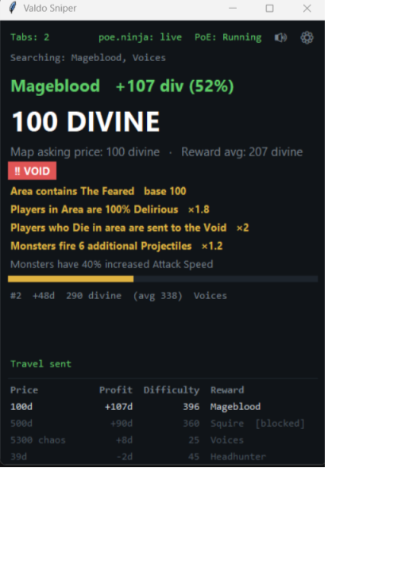

# Valdo Map Sniper

Watches your live searches on the official PoE trade site for Valdo's
Puzzle Box foil maps, scores each listing's **divine profit against the
reward's real market price** (trade-API average of the cheapest unid
copies, adjusted for how nasty the map's mods are), alerts with sound +
always-on-top overlay, and travels to the seller's hideout on a single
hotkey press or overlay click. PoE 3.27+ asynchronous trading — no
whispers; you complete the purchase manually at Faustus.



*A 100-div Mageblood map alerting at +107 div profit (52%). Scoring mods
are highlighted with their difficulty modifiers, VOID gets a red warning
chip, and the live feed at the bottom shows every incoming listing —
grayed out when below threshold or mod-blocked.*

**Trade etiquette / ToS stance (non-negotiable, see CLAUDE.md):** one user
input = one server action. The Travel click fires only in direct response
to your hotkey press or overlay click — never on detection, never queued,
never retried. Listings come from the browser's live-search push, not API
polling.

## Setup

1. **Python side** (Windows, Python 3.12):
   ```
   pip install websockets httpx keyboard pygetwindow pywin32 psutil PyYAML python-dotenv
   ```
   Dev extras: `pip install pytest pytest-asyncio ruff`

2. **Browser side** (Chrome): install the
   [Tampermonkey](https://www.tampermonkey.net/) extension, then create a
   new userscript and paste in `userscript/valdo-sniper.user.js`.
   Re-paste after any update to the file (check `@version`).

3. **Config**: edit `config.yaml` — the important knobs:
   - `thresholds.global_profit_div` — divine orbs of profit required to
     alert (per-reward overrides in `per_map`).
   - `mod_scoring` — difficulty rules; harder maps need more profit
     (`required = threshold × score / 100` — the threshold is what a
     100-difficulty map needs; 200 difficulty doubles it). Tune values live
     from the overlay's ⚙ panel; saved tweaks land in
     `scoring_overrides.yaml`.
   - `mod_warnings` — hard `block` rules (log-only, never alert).
   - `hotkey.combo` (default `ctrl+alt+t`) and `hotkey.consume`
     (`all`: a press clears every alert; `top`: runners-up stay).
   - `prices` — manual per-reward overrides; always win over poe.ninja.
   - `league: auto` resolves the current challenge league at startup.

   Secrets (only if ever needed) go in `.env` (`cp .env.example .env`),
   never in config or git.

4. **Run**: `python -m sniper` (add `--headless` for no overlay,
   `--config path` for an alternate config).

5. Open your Valdo live searches in Chrome tabs. The overlay header should
   show `tabs: N` (green), `poe.ninja: live`, `PoE: running`.

## Using it

- **Alert** = chime + overlay: reward name (sans "Foil"), profit in div,
  listing price big **with currency**, market average underneath.
- **Red MISMATCH banner** = the listing's currency differs from the
  reference currency (classic "20 exalted, not 20 divine" bait) — read
  before you buy.
- **‼ chips**: red VOID (die = character sent to void), yellow BISMUTH /
  BLIGHT. Yellow ⚠ chips come from your `mod_warnings` warn rules.
- **Hotkey** travels to the highest-surplus alert; **clicking any alert
  row** travels to that specific listing. Both require the PoE process to
  be running. After traveling, the map's full mod list stays pinned for
  ~10s so you can read it during the loading screen.
- **🔇** mutes alert sounds; **⚙** opens the live scoring tuner.
- Hot items sometimes pop a confirmation dialog on the trade site; the
  userscript auto-accepts it once, within 3s of your travel click
  (status line shows `travel sent (auto_confirmed)`).

Run PoE in **windowed-fullscreen**, not exclusive fullscreen, or the
overlay can't stay on top (sound still works either way).

## Maintenance

- **Trade site DOM changed?** All selectors live in the `SELECTORS` block
  at the top of the userscript. Save the results page (Ctrl+S), extract
  the container into `tests/fixtures/results_snapshot.html`, run
  `python tools/build_harness.py`, then open `tests/harness/harness.html`
  (file://) — fix selectors until it's all green.
- **Mod patterns**: every listing's full mod list is logged; check
  `logs/sniper-*.jsonl` after a session and tune `mod_scoring` match
  strings against real wording.
- **Latency**: `python tools/latency_report.py` prints p50/p90/p99 for
  the hot path (target: frame→UI under 150 ms; typically ~16 ms).
- **Tests**: `pytest` · **Lint**: `ruff check . && ruff format .`
- **Record/replay**: `python tools/record.py` captures real frames;
  `python tools/replay.py [file]` feeds them back through the pipeline.
  `python tools/echo_server.py` is a bare frame viewer for userscript work.

## Troubleshooting

| Symptom | Fix |
|---|---|
| `cannot bind ws://127.0.0.1:8765` | Another sniper/echo server is running — close it. |
| `could not register global hotkey` | Run the terminal elevated, or pick another combo. |
| Overlay shows `tabs: 0` | Tab not connected: check Tampermonkey is enabled on the trade page, look for `[valdo]` lines in the tab's DevTools console. |
| `tabs: N (M stale)` | A tab stopped heartbeating (crashed/asleep) — reload it. |
| `poe.ninja: stale` / `prices: manual` | API unreachable or disabled; margins use the last fetch or your manual `prices`/`currency_rates`. |
| Alerts but hotkey does nothing | `PoE: NOT RUNNING` in the header — the hotkey is deliberately inert without the game. |
| Firefox | Not supported — Chrome only (`ws://127.0.0.1` from HTTPS pages). |
